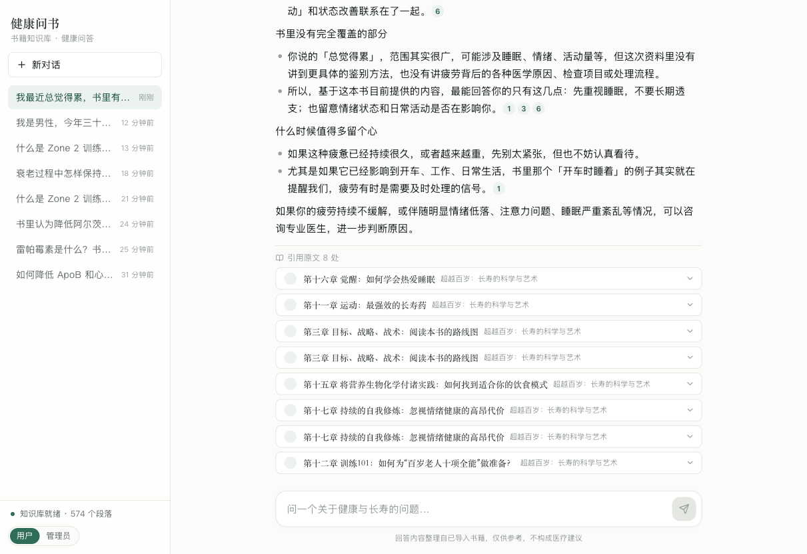

# 健康问书 HealthRAG

这是一个在自己电脑上运行的 AI 健康问答工具。它只根据导入的书（目前是《超越百岁：长寿的科学与艺术》）来回答问题，每句结论都能点开看到书里的原文出处，不会自己瞎编。

问题和回答全程在你自己的电脑上处理，书的内容不会上传到任何地方。



---

# 一、给使用者：三步就能装好

你不需要懂技术。把下面这段话**原样复制**给你的 AI 助手（Claude Code、Cursor、或任何能在你电脑上执行命令的 AI），它会照着这份文档把所有事情做完：

```
请阅读这个文件夹里的 README.md，按照里面「二、给 AI 助手：完整安装步骤」
那一章，一步一步在我的电脑上安装并启动这个项目。
我的电脑上什么开发工具都没有，需要你从零开始装。
每装完一步请告诉我进度；需要我输入电脑开机密码时请提醒我。
```

## 你需要准备的东西

| 需要什么 | 从哪来 | 说明 |
|---|---|---|
| 这个项目文件夹 | 同事发给你的压缩包 | 解压到任意位置，路径里最好不要有中文和空格 |
| 一个 API 密钥 | 同事单独发给你 | 形如 `sk-xxxxx`，这是调用 AI 的钥匙，**不要发到公开的地方** |
| 网络 | — | 安装过程要下载约 1.5GB 内容，建议连 Wi-Fi |
| 磁盘空间 | — | 大约需要 3GB |

## 大概要多久

首次安装 **15～30 分钟**，主要时间花在下载上（AI 会自动等待）。装好之后，以后每次打开只要几秒。

---

# 二、给 AI 助手：完整安装步骤

> 这一章是给执行安装的 AI 看的。请按顺序执行，**每一步都要跑「验证」命令确认成功后再进入下一步**。遇到验证失败，先看第五章「出问题怎么办」，不要跳过。

## 步骤 0：确认基本情况

```bash
# 确认当前在项目文件夹里（应该能看到 package.json）
ls package.json
```

同时确认操作系统是 macOS 还是 Windows，后面的命令分两种写法，请选对应的那一套。

---

## 步骤 1：安装 Node.js（运行环境）

先检查是否已安装：

```bash
node -v
```

**如果输出的版本号 ≥ v22.5.0，跳过这一步。** 否则按下面安装。

### macOS

```bash
# 如果已经有 Homebrew（运行 brew -v 能看到版本号），用这个：
brew install node
```

没有 Homebrew 的话，不必专门去装 Homebrew（那会额外花很久）。请让使用者到 <https://nodejs.org> 下载 **LTS 版本**的 `.pkg` 安装包，双击、一路点「继续」即可。安装过程需要输入电脑开机密码。

### Windows

```powershell
winget install OpenJS.NodeJS.LTS
```

装完后**关掉终端窗口重新打开**（否则命令找不到）。

### ✅ 验证

```bash
node -v
npm -v
```

必须能看到 Node 版本号 **v22.5.0 或更高**。低于这个版本项目跑不起来（本项目用了 Node 22 才有的内置数据库功能）。

---

## 步骤 2：安装 Ollama 并下载向量模型

Ollama 负责在本地把文字转成向量，让系统能「按意思」检索书的内容。这一步下载量最大。

> **注意：向量模型不在同事发来的压缩包里，必须在这一步由你下载。**
> 模型体积约 1.1GB，会存到系统目录（macOS 是 `~/.ollama`，Windows 是 `C:\Users\<用户名>\.ollama`），
> 不在项目文件夹内。这是正常设计 —— 模型对每个人都一样，从官方源下载比传文件更快也更可靠。

### 安装 Ollama

**macOS：**

```bash
# 有 Homebrew 的话：
brew install --cask ollama
```

没有 Homebrew：到 <https://ollama.com/download> 下载 macOS 版，解压后把 Ollama 拖进「应用程序」文件夹，然后**打开它一次**（菜单栏会出现一个羊驼图标，说明已在后台运行）。

**Windows：**

```powershell
winget install Ollama.Ollama
```

装完后从开始菜单打开 Ollama，它会在后台常驻。

### 下载向量模型（约 1.1GB，需要几分钟）

```bash
ollama pull bge-m3
```

### ✅ 验证

```bash
ollama list
```

列表里必须有 `bge-m3`。再确认服务正常：

```bash
curl http://127.0.0.1:11434/api/tags
```

能返回 JSON 就说明 Ollama 在后台正常运行。**如果连接被拒绝**，说明 Ollama 没启动 —— macOS 打开「应用程序」里的 Ollama，Windows 从开始菜单打开它。

---

## 步骤 3：填入 API 密钥

项目需要一把钥匙才能调用 AI 回答问题。

> 密钥、网关地址、模型名称也可以**装好之后在网页上直接填**（管理页有「模型配置」，见步骤 7）。
> 如果使用者手上暂时没有密钥，可以先跳过这一步，把项目启动起来再到网页里填。

**先检查文件夹里是否已经有 `.env.local` 文件**（同事可能已经放好了）：

```bash
# macOS
ls -a .env.local
# Windows
dir .env.local
```

**如果已存在，跳过这一步。** 如果不存在，创建它：

```bash
# macOS
cp .env.example .env.local

# Windows
copy .env.example .env.local
```

然后编辑 `.env.local`，把这一行的值换成使用者拿到的密钥：

```
AI_API_KEY=sk-把这里替换成真实密钥
```

其余几行保持原样即可（默认就是本地 Ollama + 网关的 gpt-5.4）。

### ✅ 验证

```bash
# macOS
grep AI_API_KEY .env.local
# Windows
findstr AI_API_KEY .env.local
```

确认不再是 `sk-xxxx` 这样的占位符。

---

## 步骤 4：安装项目依赖

```bash
npm install
```

需要 1～3 分钟。出现 warning 属正常，只要最后没有 `ERR!` 就算成功。

### ✅ 验证

```bash
# macOS
ls node_modules/next/package.json
# Windows
dir node_modules\next\package.json
```

文件存在即成功。

---

## 步骤 5：构建并启动

```bash
npm run build
npm start
```

构建约 1 分钟。看到下面这样的输出就说明启动成功：

```
▲ Next.js 16.1.1
- Local:  http://localhost:3000
✓ Ready in 300ms
```

**这个终端窗口要一直开着**，关掉网站就打不开了。

### ✅ 验证

**另外开一个终端窗口**，运行：

```bash
curl http://localhost:3000/api/health
```

返回的内容里要满足这两点：

- `"embedding": { "ok": true, ... }` —— 本地向量服务正常
- `"keyPresent": true` —— 密钥已读到

然后让使用者用浏览器打开 <http://localhost:3000>，应该能看到「健康问书」的界面。

---

## 步骤 6：确认知识库有内容

在浏览器里看**左下角的状态点**：

- 显示「**知识库就绪 · 574 个段落**」→ 书已经带过来了，安装全部完成，可以直接提问 ✅
- 显示「**知识库为空**」→ 需要导入书，继续下一步

### 需要导入书时

1. 点左下角的「**管理员**」按钮切换身份
2. 点右边出现的「**知识库管理**」
3. 把书的文件拖进上传区（支持 `.txt` / `.md` / `.docx` / `.epub`），点「导入并向量化」
4. 等进度条走完、状态变成「就绪」。20 万字的书约需 1～3 分钟
5. 点左上角「返回问答」，切回「用户」身份

### ✅ 最终验证

在输入框里问一句：

```
什么是 Zone 2 训练？
```

正常的回答应该是：开头一行「祝你健康」，然后直接给结论，下面分点展开，最底部有一排可以展开的「引用原文」卡片。**看到引用卡片就说明整套系统跑通了。**

---

## 步骤 7：换成自己的模型（可选）

如果使用者想用别的 AI 服务商、别的模型，**不用改任何文件**，在网页上就能配置：

1. 切换到「管理员」→ 进入「知识库管理」
2. 找到「**模型配置**」区块，可以填：
   - **AI 网关地址**：任何 OpenAI 兼容的接口（通常以 `/v1` 结尾）
   - **API 密钥**：留空表示不改动已保存的密钥
   - **回答模型 / 辅助模型**：不知道填什么就点「**拉取网关上的可用模型**」，会自动列出该网关支持的所有模型供选择
   - **向量化方式**：本地 Ollama（推荐）或走网关
3. 点「**测试连接**」——会实际调用一次，三项分别显示是否可用和耗时。**全部打勾再点保存**
4. 保存后**立即生效，不需要重启服务**

> ⚠️ 如果改了「向量化方式」或「向量模型」，保存后必须点上方的「**重建全部索引**」重新生成向量，
> 否则提问会报索引不匹配。改回答模型则不受影响。
>
> 想退回到 `.env.local` 里的原始配置，点右下角「恢复 .env 默认」。

---

# 三、装好之后：日常怎么用

### 每次要用的时候

1. 确认 Ollama 在后台运行（macOS 看菜单栏羊驼图标，Windows 看任务栏）
2. 打开终端，进入项目文件夹，运行：

```bash
npm start
```

3. 浏览器打开 <http://localhost:3000>

### 用完关闭

在终端里按 `Ctrl + C`，然后关掉窗口即可。

### 两种身份

右下角可以切换：

- **用户**：只能提问（给最终用户看的界面）
- **管理员**：多一个「知识库管理」入口，可以导入或删除书

这是 Demo 的简化设计，切换不需要密码。

---

# 四、常见问题速查

| 现象 | 原因 | 怎么解决 |
|---|---|---|
| 浏览器打不开页面 | 服务没在运行 | 回到终端跑 `npm start`，保持窗口开着 |
| 回答区提示「无法连接本地 Ollama」 | Ollama 没启动 | 打开 Ollama 应用；或终端跑 `ollama serve` |
| 提示「AI 网关调用失败 (401)」 | 密钥不对或已失效 | 到管理页「模型配置」重填密钥，点「测试连接」确认；或检查 `.env.local` |
| 提示「模型不存在 / model_not_found」 | 模型名填错，或该网关没有这个模型 | 管理页「模型配置」点「拉取网关上的可用模型」，从列表里选 |
| 提示「Ollama 里没有模型 xxx」 | 向量模型没下载 | 按提示在终端运行 `ollama pull xxx` |
| 提问报「索引不匹配」 | 换了向量模型但没重建索引 | 管理页点「重建全部索引」 |
| 提示「知识库目前还没有可用内容」 | 书没导入 | 按步骤 6 导入 |
| 启动时报 `EADDRINUSE`（端口被占用） | 3000 端口被别的程序占了 | 换端口：`npm start -- -p 3001`，然后访问 3001 |
| `npm install` 卡住或失败 | 网络问题 | 换网络重试；或用国内镜像：`npm install --registry=https://registry.npmmirror.com` |
| 命令提示 `node: command not found` | Node 没装好或终端没重开 | 关掉终端重新打开；再不行重做步骤 1 |
| 导入书后状态一直是「失败」 | 多半是 Ollama 中途退出了 | 确认 Ollama 在运行，在管理页点该文档的「重试」 |
| 回答很慢（超过 30 秒） | 正常现象 | 首次提问模型要预热；本地向量检索本身只要 0.1 秒 |

### 想推倒重来

删掉项目文件夹里的 `data` 目录，重新启动即可。**注意：这会清空所有已导入的书和聊天记录。**

---

# 五、给发送方（Niels）：怎么打包发给同事

在项目所在目录执行下面的命令，会生成一个约 **5MB** 的压缩包（已实测）：

```bash
cd /Users/niels/Desktop/NWorkspace/Projects
zip -r HealthRAG-给同事.zip HealthRAG \
  -x "HealthRAG/node_modules/*" "HealthRAG/.next/*" "HealthRAG/.git/*" \
     "HealthRAG/The Science and Art of Longevity/*" \
     "HealthRAG/*.png" "HealthRAG/*.tsbuildinfo" "*.DS_Store"
```

> 打包前先在运行服务的终端按 `Ctrl + C` 停掉服务，这样数据库文件是完整一致的状态。

**关于两个敏感/可选项，发送前请自己决定：**

| 文件 | 带上会怎样 | 建议 |
|---|---|---|
| `.env.local` | 里面有你的 API 密钥，同事解压即用，不用手动配 | 若通过私密渠道发送可以带上；否则删掉它，密钥用微信/飞书单独发 |
| `data/` 目录（12MB） | 包含已建好索引的《超越百岁》，同事跳过导入和向量化，装完直接能问 | **建议带上**，索引签名是 `ollama:bge-m3:1024`，换台电脑照样能用。里面也含你的聊天记录，介意的话先删掉 `data/healthrag.db` 只保留 `data/books/` |

上面的 zip 命令默认**两个都带上**。要排除的话，在命令末尾追加 `-x "HealthRAG/.env.local"` 或 `-x "HealthRAG/data/*"`。

**不需要打包的东西**（上面的命令已自动排除，这里说明原因）：

| 排除项 | 体积 | 为什么不用带 |
|---|---|---|
| `node_modules/` | 640MB | 依赖库，同事跑 `npm install` 会自己装 |
| `.next/` | 199MB | 构建产物，同事跑 `npm run build` 会自己生成 |
| **Ollama 向量模型** | 1.1GB | 存在系统目录 `~/.ollama`，本来就不在项目文件夹内。同事按步骤 2 跑一句 `ollama pull bge-m3` 就从官方源下载了，比传文件快得多 |
| `The Science and Art of Longevity/` | 22MB | 电子书原件（epub/azw3/pdf/mobi）。`data/` 里已有提取好的正文和建好的索引，重复携带没有意义 |
| 截图、构建缓存 | <1MB | 开发过程产物 |

所以最终压缩包只有约 **5MB**，微信、飞书都能直接发。

---

# 六、技术参考

面向了解开发的人，安装不需要看这部分。

## 架构

Next.js 16（App Router）+ TypeScript + Tailwind v4，单进程本地运行。数据库是单文件 SQLite（`data/healthrag.db`，用 Node 22 内置的 `node:sqlite`，无需任何原生编译），正文、向量 BLOB、FTS5 索引、会话记录都在里面。

问答链路：查询改写 → 混合检索 → 组装上下文 → 流式生成（SSE）。

## 核心设计

- **混合检索**：bge-m3 向量余弦 + SQLite FTS5 关键词（BM25），用 RRF 融合。单书规模（574 段）内存暴力算余弦，全程约 120ms
- **中文分词**：Node 内置 `Intl.Segmenter`，零第三方依赖，解决 FTS5 默认分词器不支持中文的问题
- **文件解析**：docx / epub 的 zip + XML 解析为手写实现，无第三方库；中文 txt 自动识别 GBK 编码
- **分块**：先按章节标题切分，再在章节内按句子边界打包（约 500 字/块，80 字重叠），块继承章节名用于溯源
- **多轮对话**：追问自动改写为独立检索问题；超过 10 条消息把较早历史压缩成滚动摘要，保留最近 6 条原文
- **幻觉护栏**：System prompt 限定只依据检索到的原文回答，书里没有的内容明确说明

## 配置项

模型相关的配置有两个来源，**管理页的设置优先于 `.env.local`**：

- `.env.local` 提供默认值（首次启动用）
- 管理页「模型配置」保存的值存在 `data/healthrag.db` 的 `meta` 表（`cfg_` 前缀），覆盖默认值

所有调用点都通过 `getConfig()` 实时读取，改完设置立即生效，不需要重启。点「恢复 .env 默认」会清空覆盖项。只有与 `.env` 默认值不同的字段才会被记为覆盖，界面上标「页面设置」。

| 变量（.env.local） | 说明 | 默认 |
|---|---|---|
| `AI_BASE_URL` / `AI_API_KEY` | OpenAI 兼容网关 | `https://ai.buidlerdao.xyz/v1` |
| `CHAT_MODEL` | 主回答模型 | `gpt-5.4` |
| `UTILITY_MODEL` | 查询改写 / 历史压缩 | `deepseek-v4-flash` |
| `EMBEDDING_PROVIDER` | `ollama`（本地）或 `gateway`（网关，需网关已开通 embedding 渠道） | `ollama` |
| `OLLAMA_EMBED_MODEL` | 本地向量模型 | `bge-m3` |

切换 embedding 通道后需在管理页点「重建全部索引」。系统用索引签名（如 `ollama:bge-m3:1024`）自动检测配置与已建索引不一致的情况并给出提示。密钥在接口层永远只回传打码值（`sk-Qy••••••tBoj`），提交打码值等同于「不修改」。

## 目录结构

```
src/lib/        parsers 解析 · chunking 分块 · segment 分词 · embeddings 向量
                retrieval 检索 · rag 编排 · ingest 入库 · ai 网关 · db 数据库
src/app/api/    chat(SSE) · documents · conversations · health · reindex · settings
src/components/ ChatApp · AdminPanel · ModelSettings · SourceCards · Markdown
scripts/        test-pipeline.ts  解析/分块/分词自测
data/           healthrag.db（全部数据）· books/（书籍原文）
```

自测：`node scripts/test-pipeline.ts`（15 项，覆盖 docx/epub/GBK 解析、章节分块、中英混合分词）

## 开发模式

```bash
npm run dev     # 热更新，改代码即时生效
```

注意：Next 16 的 dev 模式（Turbopack）会把请求分派到独立 worker 进程，上传大书后的后台向量化若中断，在管理页点「重试」可断点续传。**演示请用 `npm run build && npm start` 的生产模式**，没有这个问题。

## 已知限制（Demo 范围）

- 不支持 PDF，需先转成 epub / docx / txt
- 身份切换是纯前端 cookie，无真实鉴权（按需求简化）
- 单机单进程，所有数据在本地 `data/` 目录
- 每条消息都会走完整检索链路，闲聊类消息（如「谢谢」）也会触发检索，有优化空间
